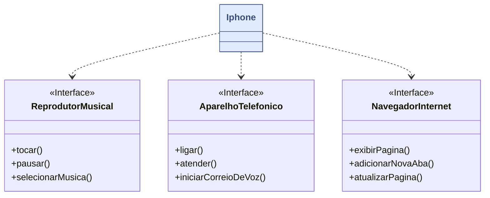

# desafioIphone

```mermaid
classDiagram
direction TB
    class ReprodutorMusical {
	    +tocar()
	    +pausar()
	    +selecionarMusica()
    }

    class AparelhoTelefonico {
	    +ligar()
	    +atender()
	    +iniciarCorreioDeVoz()
    }

    class NavegadorInternet {
	    +exibirPagina()
	    +adicionarNovaAba()
	    +atualizarPagina()
    }

    class Iphone {
    }

	<<Interface>> ReprodutorMusical
	<<Interface>> AparelhoTelefonico
	<<Interface>> NavegadorInternet

    Iphone ..> ReprodutorMusical
    Iphone ..> AparelhoTelefonico
    Iphone ..> NavegadorInternet

	style Iphone fill:#bfb,stroke:#6f6,stroke-width:2px,color:#000,stroke-dasharray: 5 5

	class Iphone:::Sky

	classDef Sky :,stroke-width:1px, stroke-dasharray:none, stroke:#374D7C, fill:#E2EBFF, color:#374D7C
```

